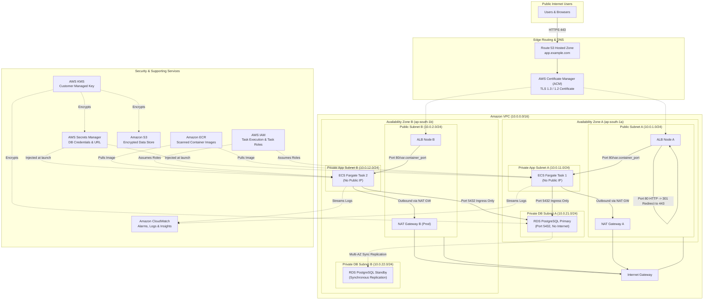

# Production-Ready 3-Tier AWS Infrastructure Platform with Terraform

[](https://www.terraform.io)
[](https://aws.amazon.com)
[](https://github.com/features/actions)
[](https://www.checkov.io)

An enterprise-grade, highly available, secure, and scalable Three-Tier AWS platform provisioned via modular Terraform. Adheres strictly to the **AWS Well-Architected Framework**, zero-trust security boundaries, least-privilege IAM, encrypted storage, and automated multi-environment deployments (`dev`, `staging`, `prod`).

---

## Table of Contents

1. [Project Overview](#1-project-overview)
2. [Architecture Diagram](#2-architecture-diagram)
3. [AWS Services Utilized](#3-aws-services-utilized)
4. [Architecture Explanation](#4-architecture-explanation)
5. [Repository Structure](#5-repository-structure)
6. [Prerequisites](#6-prerequisites)
7. [AWS Authentication & OIDC](#7-aws-authentication--oidc)
8. [Terraform Installation](#8-terraform-installation)
9. [Remote State Backend Bootstrap](#9-remote-state-backend-bootstrap)
10. [Environment Configuration](#10-environment-configuration)
11. [Terraform Initialization](#11-terraform-initialization)
12. [Terraform Plan](#12-terraform-plan)
13. [Terraform Apply](#13-terraform-apply)
14. [Application Deployment](#14-application-deployment)
15. [DNS Configuration](#15-dns-configuration)
16. [HTTPS & SSL/TLS Configuration](#16-https--ssltls-configuration)
17. [Monitoring & Observability](#17-monitoring--observability)
18. [Auto Scaling Strategy](#18-auto-scaling-strategy)
19. [Security Architecture & Zero Trust](#19-security-architecture--zero-trust)
20. [Disaster Recovery & Business Continuity](#20-disaster-recovery--business-continuity)
21. [Troubleshooting Guide](#21-troubleshooting-guide)
22. [Decommissioning (Terraform Destroy)](#22-decommissioning-terraform-destroy)
23. [Cost Considerations](#23-cost-considerations)

---

## 1. Project Overview

This platform establishes a cloud infrastructure foundation on Amazon Web Services (AWS) using modular Terraform code. It separates concerns across three dedicated network tiers:

1. **Presentation / Web Layer**: High-availability Application Load Balancer (ALB) distributed across multiple public subnets handling public TLS termination and traffic routing.
2. **Application Layer**: Containerized workloads hosted on Amazon ECS Fargate running inside private application subnets with no public IP exposure. Egress is mediated through NAT Gateways.
3. **Database Layer**: Amazon RDS PostgreSQL running in completely isolated private database subnets with automated backups, KMS encryption at rest, and zero direct internet access.

---

## 2. Architecture Diagram



---

## 3. AWS Services Utilized

- **Amazon VPC**: Isolated virtual cloud network with 6 subnets across 2 AZs.
- **NAT Gateways & Elastic IPs**: Outbound internet translation for private compute.
- **Application Load Balancer (ALB)**: Layer 7 load balancer with automatic HTTP-to-HTTPS redirect.
- **Amazon ECS & AWS Fargate**: Serverless container orchestration running stateless tasks in private subnets.
- **Amazon RDS PostgreSQL**: Managed relational database engine configured for high availability (Multi-AZ in production).
- **AWS Secrets Manager**: Automatic generation and secure runtime injection of database credentials without plaintext persistence.
- **AWS Key Management Service (KMS)**: Customer Managed Keys (CMK) enforcing envelope encryption across all tiers.
- **Amazon Elastic Container Registry (ECR)**: Private Docker registry with automatic image scanning on push and lifecycle cleanup rules.
- **Amazon CloudWatch**: Log centralization, Container Insights, and metric alarms for CPU, memory, latency, and 5xx errors.
- **Amazon Route 53**: Scalable DNS alias routing pointing to the Application Load Balancer.
- **AWS Certificate Manager (ACM)**: Free SSL/TLS certificates with automated Route 53 DNS validation.
- **Amazon S3**: High-durability object storage for application assets and log archives with bucket policies enforcing TLS 1.2+.
- **AWS IAM**: Strict least-privilege policies separating ECS Task Execution (agent operations) from ECS Task Role (application logic).

---

## 4. Architecture Explanation

### 1. Ingress & Presentation Tier
Incoming traffic hits Route 53, which resolves the custom domain alias to the Application Load Balancer. The ALB spans two public subnets. Port 80 listeners immediately return an `HTTP 301` redirect to Port 443 (HTTPS), ensuring unencrypted requests never touch the backend.

### 2. Application Tier
The ALB forwards requests over private VPC networking to Amazon ECS tasks powered by AWS Fargate. Tasks run exclusively in private application subnets and have **zero public IP addresses**. When tasks boot, the ECS agent assumes the `ECS Task Execution Role` to pull container images from private ECR and retrieve database connection parameters directly from AWS Secrets Manager.

### 3. Data Tier
The database tier consists of Amazon RDS PostgreSQL deployed inside dedicated private database subnets. The private DB route table has **no route to the Internet Gateway and no route to the NAT Gateway**, providing complete physical network isolation. Access to port `5432` is constrained via security group rules strictly to the ECS task security group. In production, Multi-AZ replication ensures synchronous standby failover in the event of an availability zone failure.

---

## 5. Repository Structure

```
terraform-aws-3tier-platform/
├── README.md                           # Comprehensive architecture and operation guide
├── COST.md                             # Detailed pricing breakdown and optimization strategies
├── .gitignore                          # Clean gitignore excluding state, tfvars, and cache
├── versions.tf                         # Root Terraform and AWS/Random provider requirements
├── providers.tf                        # AWS Provider configuration with default tagging
├── locals.tf                           # Standard naming prefixes and resource tagging
├── .checkov.yml                        # Checkov static security analysis configuration
├── .tflint.hcl                         # TFLint ruleset configuration for AWS
│
├── environments/
│   ├── dev/                            # Development environment (Cost-optimized, 1 NAT GW)
│   │   ├── main.tf
│   │   ├── variables.tf
│   │   ├── terraform.tfvars
│   │   └── outputs.tf
│   │
│   ├── staging/                        # Staging environment (Pre-production scale)
│   │   ├── main.tf
│   │   ├── variables.tf
│   │   ├── terraform.tfvars
│   │   └── outputs.tf
│   │
│   └── prod/                           # Production environment (Multi-AZ, deletion protection, HA)
│       ├── main.tf
│       ├── variables.tf
│       ├── terraform.tfvars
│       └── outputs.tf
│
├── modules/
│   ├── vpc/                            # VPC, subnets, IGW, NAT Gateways, Flow Logs
│   ├── security-groups/                # ALB, ECS, and RDS layered security groups
│   ├── iam/                            # Task Execution & Task Roles (Least Privilege)
│   ├── alb/                            # Application Load Balancer, Target Groups, Listeners
│   ├── ecr/                            # ECR repo with vulnerability scanning and lifecycle
│   ├── ecs/                            # Fargate Cluster, Task Definition, and Service
│   ├── autoscaling/                    # AppAutoScaling target tracking (CPU & Memory)
│   ├── rds/                            # RDS PostgreSQL instance, parameter group, monitoring
│   ├── secrets-manager/                # Secure credential generation and secret storage
│   ├── kms/                            # KMS Customer Managed Key with automated rotation
│   ├── s3/                             # S3 supporting bucket (TLS enforce, public access block)
│   ├── route53/                        # DNS alias records for ALB
│   ├── acm/                            # SSL/TLS Certificate and Route 53 validation
│   └── cloudwatch/                     # Metric alarms (ECS CPU/Mem, ALB 5xx/latency, RDS)
│
├── scripts/
│   ├── bootstrap.sh                    # Creates remote S3 backend bucket & DynamoDB lock table
│   ├── validate.sh                     # Runs recursive format, init, validate, and linting
│   └── github-actions-oidc.tf          # Terraform template to provision GitHub Actions OIDC IAM role
│
└── .github/
    └── workflows/
        ├── pr-validation.yml           # PR format, validate, Checkov, tfsec, and plan
        └── deploy.yml                  # Automated CD via GitHub OIDC with production gate
```

---

## 6. Prerequisites

Ensure you have the following installed on your local workstation:
- **Terraform** (`>= 1.6.0`)
- **AWS CLI v2** configured with proper IAM permissions
- **Git**
- **Docker** (optional, for building and pushing application images to ECR)

---

## 7. AWS Authentication & OIDC

### Local Development Authentication
Configure your AWS credentials using standard environment variables or AWS CLI profiles:
```bash
aws configure
# OR
export AWS_ACCESS_KEY_ID="AKIA..."
export AWS_SECRET_ACCESS_KEY="..."
export AWS_DEFAULT_REGION="ap-south-1"
```

### GitHub Actions OIDC Authentication (No Static Keys)
This project uses **OpenID Connect (OIDC)** to authenticate GitHub Actions directly with AWS IAM, eliminating the security risk of storing long-lived AWS Access Keys in GitHub Secrets.

To set up the OIDC provider and IAM Role in your AWS account:
1. Review `scripts/github-actions-oidc.tf`.
2. Apply the role:
   ```bash
   aws iam create-open-id-connect-provider \
     --url https://token.actions.githubusercontent.com \
     --client-id-list sts.amazonaws.com \
     --thumbprint-list 6938fd4d98bab03faadb97b34396831e3780aea1
   ```
3. Set the GitHub Repository Secret `AWS_OIDC_ROLE_ARN` to the created role ARN.

---

## 8. Terraform Installation

Install Terraform via Homebrew (macOS) or HashiCorp package repositories:
```bash
# macOS
brew tap hashicorp/tap
brew install hashicorp/tap/terraform

# Verify installation
terraform -version
```

---

## 9. Remote State Backend Bootstrap

To ensure state is safely stored in Amazon S3 with distributed locking via DynamoDB:

1. Run the provided bootstrap script:
   ```bash
   ./scripts/bootstrap.sh ap-south-1 terraform-aws-3tier-platform
   ```
2. The script outputs the S3 bucket name and DynamoDB lock table.
3. Uncomment the `backend "s3"` block in `environments/<env>/main.tf` with the generated bucket name.

---

## 10. Environment Configuration

Three environments are pre-configured:
- **`environments/dev/terraform.tfvars`**: Minimal compute sizes (`db.t4g.micro`, 1 NAT Gateway, 1 ECS task).
- **`environments/staging/terraform.tfvars`**: Medium sizing (`db.t4g.small`, 2 ECS tasks) for pre-release validation.
- **`environments/prod/terraform.tfvars`**: Production grade (`db.r6g.large`, Multi-AZ RDS, 2 NAT Gateways, deletion protection enabled).

Customize your domain or container specs directly in the corresponding `terraform.tfvars`.

---

## 11. Terraform Initialization

Navigate to your target environment and initialize:
```bash
cd environments/dev
terraform init
```

---

## 12. Terraform Plan

Execute an execution plan to verify the proposed resource changes:
```bash
terraform plan
```

---

## 13. Terraform Apply

Deploy the entire infrastructure stack:
```bash
terraform apply
```
*Review the summary and enter `yes` when prompted.*

Once applied, Terraform prints the output summary:
- `alb_dns_name`: Public URL to access the application
- `ecr_repository_url`: Docker repository to push images
- `rds_endpoint`: Database internal connection endpoint
- `cloudwatch_log_group`: Log stream destination

---

## 14. Application Deployment

To deploy your custom application container to the provisioned ECR and ECS service:

```bash
# 1. Authenticate Docker with Amazon ECR
aws ecr get-login-password --region ap-south-1 | docker login --username AWS --password-stdin <ECR_URL>

# 2. Build your Docker image
docker build -t <ECR_URL>:latest .

# 3. Push image to Amazon ECR
docker push <ECR_URL>:latest

# 4. Force ECS to pull the latest image and update service
aws ecs update-service \
  --cluster terraform-aws-3tier-platform-dev-cluster \
  --service terraform-aws-3tier-platform-dev-service \
  --force-new-deployment \
  --region ap-south-1
```

---

## 15. DNS Configuration

If configuring a custom domain:
1. Set `domain_name = "example.com"` and `record_subdomain = "app"` in `environments/<env>/terraform.tfvars`.
2. The `route53` module automatically creates `A` and `AAAA` alias records pointing to the ALB.
3. If managing DNS in an external provider (Cloudflare, GoDaddy), create a `CNAME` pointing your subdomain to `alb_dns_name`.

---

## 16. HTTPS & SSL/TLS Configuration

- When `domain_name` is supplied, the `acm` module requests a certificate with DNS validation.
- The ALB HTTP listener on Port 80 automatically redirects all unencrypted HTTP traffic to HTTPS (Port 443) using `HTTP 301`.
- Modern TLS security policy `ELBSecurityPolicy-TLS13-1-2-2021-06` is enforced, blocking legacy protocols (TLS 1.0/1.1 and insecure ciphers).

---

## 17. Monitoring & Observability

Observability is integrated natively via Amazon CloudWatch:

1. **VPC Flow Logs**: Captures all IP traffic metadata within the VPC and ships to `/aws/vpc-flow-logs/<env>`.
2. **Container Logs**: Standard out and standard error from ECS containers stream to `/ecs/<env>-app`.
3. **CloudWatch Alarms**:
   - High ECS CPU utilization (`>= 80%`)
   - High ECS Memory utilization (`>= 80%`)
   - ALB 5XX error rate (`> 10` per minute)
   - ALB target latency (`> 1.0s`)
   - RDS CPU utilization (`>= 80%`)
   - RDS Low free storage (`< 5GB`)
4. **SNS Alerting**: Triggered alarms publish notifications to an encrypted Amazon SNS topic.

---

## 18. Auto Scaling Strategy

ECS tasks automatically scale horizontally using **Application Auto Scaling** target tracking policies:
- **CPU Target Tracking**: Scales tasks out or in to maintain an average of **60% CPU utilization**.
- **Memory Target Tracking**: Scales tasks out or in to maintain an average of **70% memory utilization**.
- **Scale-Out Cooldown**: 60 seconds (rapid scaling to absorb traffic surges).
- **Scale-In Cooldown**: 300 seconds (prevents flapping during brief load dips).

---

## 19. Security Architecture & Zero Trust

- **No Public Database**: RDS instances have `publicly_accessible = false` and exist in subnets without an internet gateway route.
- **No Public ECS Compute**: Tasks operate in private subnets without public IPs. Egress traffic routes through NAT Gateways.
- **Least-Privilege Security Groups**:
  - ALB Security Group permits only 80 and 443 from the public.
  - ECS Security Group allows traffic *only* from the ALB Security Group on the container port.
  - RDS Security Group allows traffic *only* from the ECS Security Group on port 5432.
- **Encrypted at Rest**: RDS storage, S3 objects, Secrets Manager secrets, and CloudWatch logs are encrypted using AWS KMS Customer Managed Keys.
- **Encrypted in Transit**: Strict TLS 1.3 / 1.2 on ALB, S3 bucket policy denying non-HTTPS requests (`aws:SecureTransport = false`), and RDS parameter group enforcing `rds.force_ssl = 1`.
- **Zero Hardcoded Secrets**: DB passwords are dynamically generated via `random_password`, stored in Secrets Manager, and injected into ECS task definitions at startup via ARN references.

---

## 20. Disaster Recovery & Business Continuity

- **RDS Automated Backups**: Retained for 7 days (dev) or 30 days (prod) with point-in-time recovery (PITR).
- **RDS Multi-AZ**: Synchronous data replication across AZ-A and AZ-B provides automated failover within 60 seconds without data loss.
- **S3 Versioning**: Protects against accidental deletion or overwrite of objects.
- **Infrastructure Reproducibility**: Because the entire architecture is codified in declarative Terraform, a catastrophic multi-region disaster can be resolved by deploying the Terraform configuration to another AWS region (e.g. `eu-west-1` or `us-east-1`) in under 20 minutes.

---

## 21. Troubleshooting Guide

| Issue | Root Cause | Solution |
| :--- | :--- | :--- |
| **ECS Tasks failing health checks (503 Service Unavailable)** | Container not responding on `/` or taking too long to start. | Verify `health_check_path` matches application health endpoint. Check container logs in CloudWatch `/ecs/<env>-app`. |
| **ECS Tasks failing to pull images** | Private subnet routing or IAM permission issue. | Confirm NAT Gateway is functioning in public subnet and route table has `0.0.0.0/0 -> nat-gw`. Verify Task Execution Role has `AmazonECSTaskExecutionRolePolicy`. |
| **Cannot connect to RDS from ECS** | Security group rule mismatch or missing DB password. | Verify ECS SG is listed as source in RDS SG on port 5432. Verify Secrets Manager secret is valid and accessible by the ECS execution role. |
| **Terraform State Lock error** | Previous Terraform process did not release lock in DynamoDB. | Verify no teammate is currently running `terraform apply`. Run `terraform force-unlock <LOCK_ID>`. |

---

## 22. Decommissioning (Terraform Destroy)

To completely tear down and destroy all provisioned AWS resources to eliminate ongoing costs:

```bash
cd environments/dev
terraform destroy -auto-approve
```

*Note: For production, `enable_deletion_protection` is set to `true`. You must change `enable_deletion_protection = false` in `environments/prod/terraform.tfvars` before running `terraform destroy`.*

---

## 23. Cost Considerations

Detailed billing calculations, pricing models, and optimization techniques are documented in [COST.md](file:///Users/dineshs/project/terraform-aws-3tier-platform/COST.md).
- **Development**: ~\$86.50/month (utilizing 1 NAT Gateway and single-AZ micro database).
- **Production**: ~\$605.30/month (Multi-AZ redundancy, 2 NAT Gateways, 3-10 auto-scaling tasks, and production database).
