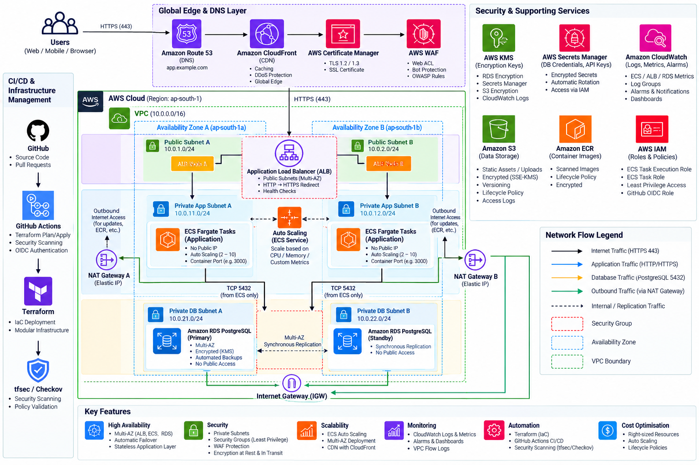

# Production-Ready 3-Tier AWS Infrastructure Platform with Terraform

[](https://www.terraform.io)
[](https://aws.amazon.com)
[](https://github.com/features/actions)
[](https://www.checkov.io)

An enterprise-grade, highly available, secure, and scalable Three-Tier AWS platform provisioned via modular Terraform. Adheres strictly to the **AWS Well-Architected Framework**, zero-trust-oriented network and access controls, least-privilege IAM, encrypted storage, and automated multi-environment deployments (`dev`, `staging`, `prod`).

---

## Table of Contents

1. [Project Overview](#1-project-overview)
2. [Architecture Diagram](#2-architecture-diagram)
3. [AWS Services Utilized](#3-aws-services-utilized)
4. [Architecture Explanation](#4-architecture-explanation)
5. [Repository Structure](#5-repository-structure)
6. [Prerequisites](#6-prerequisites)
7. [AWS Authentication & OIDC](#7-aws-authentication--oidc)
8. [Terraform Installation](#8-terraform-installation)
9. [Remote State Backend Bootstrap](#9-remote-state-backend-bootstrap)
10. [Environment Configuration](#10-environment-configuration)
11. [Terraform Initialization](#11-terraform-initialization)
12. [Terraform Plan](#12-terraform-plan)
13. [Terraform Apply](#13-terraform-apply)
14. [Application Deployment](#14-application-deployment)
15. [DNS Configuration](#15-dns-configuration)
16. [HTTPS & SSL/TLS Configuration](#16-https--ssltls-configuration)
17. [Monitoring & Observability](#17-monitoring--observability)
18. [Auto Scaling Strategy](#18-auto-scaling-strategy)
19. [Security Architecture](#19-security-architecture)
20. [Disaster Recovery & Business Continuity](#20-disaster-recovery--business-continuity)
21. [Troubleshooting Guide](#21-troubleshooting-guide)
22. [Decommissioning (Terraform Destroy)](#22-decommissioning-terraform-destroy)
23. [Cost Considerations](#23-cost-considerations)

---

## 1. Project Overview

This platform establishes a production-grade infrastructure foundation on Amazon Web Services (AWS) using modular, reusable Terraform code. It separates responsibilities across three dedicated architectural tiers:

1. **Presentation / Web Layer**: Edge routing and traffic ingress via Route 53, CloudFront edge caching, AWS WAF inspection, and a high-availability Application Load Balancer (ALB) distributed across public subnets.
2. **Application Layer**: Containerized workloads hosted on Amazon ECS Fargate running inside private application subnets with no public IP exposure. Private subnet egress is mediated through managed NAT Gateways.
3. **Database Layer**: Amazon RDS PostgreSQL running in isolated private database subnets with automated backups, KMS encryption at rest, synchronous Multi-AZ standby replication, and network isolation from direct Internet access.

The entire topology is automated through Terraform modules, supporting distinct environment configurations (`dev`, `staging`, `prod`), state locking, security linting, and passwordless CI/CD deployments via GitHub Actions OIDC.

---

## 2. Architecture Diagram

The platform follows a secure, highly available, multi-AZ three-tier architecture deployed on AWS.

### Production Architecture



*Figure: Secure, highly available, and scalable AWS 3-tier architecture provisioned using Terraform.*

---

## 3. AWS Services Utilized

### Core Architecture Tiers
- **Amazon Route 53**: Highly available cloud Domain Name System (DNS) providing global hostname resolution.
- **Amazon CloudFront**: Global content delivery network (CDN) providing edge caching and DDoS mitigation.
- **AWS WAF (Web Application Firewall)**: Edge and load balancer protection against common web exploits, SQL injections, and cross-site scripting.
- **Application Load Balancer (ALB)**: Layer 7 load balancer distributed across multiple Availability Zones, enforcing TLS termination, health checking, and reverse proxying to ECS tasks.
- **Amazon ECS & AWS Fargate**: Serverless container execution environment running stateless tasks in private subnets with horizontal auto scaling.
- **Amazon RDS PostgreSQL**: Fully managed relational database engine with automated point-in-time recovery, KMS storage encryption, and synchronous Multi-AZ standby failover.

### Supporting Services
- **Amazon Elastic Container Registry (ECR)**: Private container registry with automated vulnerability scanning on push and image lifecycle expiration rules.
- **AWS Secrets Manager**: Automatic generation, storage, and runtime injection of database credentials without plaintext persistence.
- **AWS Key Management Service (KMS)**: Customer Managed Keys (CMK) with automatic rotation enforcing envelope encryption at rest across RDS, Secrets Manager, S3, and CloudWatch.
- **Amazon CloudWatch**: Centralized log aggregation, Container Insights, VPC Flow Logs, and metric alarms for CPU, memory, 5xx errors, and latency.
- **Amazon S3**: High-durability object storage for application assets, release artifacts, and log archives with TLS enforcement and public access blocking.
- **AWS IAM**: Least-privilege roles separating container runtime execution (`ECS Task Execution Role`) from application service access (`ECS Task Role`).
- **GitHub Actions**: Continuous integration and deployment pipeline using OpenID Connect (OIDC) authentication.
- **HashiCorp Terraform**: Declarative infrastructure as code engine with remote S3 backend state locking via DynamoDB.

---

## 4. Architecture Explanation

### Tier 1 — Presentation / Web Layer

**Components:**
- Route 53
- CloudFront
- AWS WAF
- ACM (AWS Certificate Manager)
- Application Load Balancer
- Public Subnets

**Traffic Flow:**
```
Internet → Route 53 → CloudFront → AWS WAF → Application Load Balancer
```

- **Route 53** provides authoritative DNS resolution, directing user requests to the CloudFront distribution or ALB endpoint.
- **CloudFront** caches static and edge-cacheable content globally to reduce latency and origin load.
- **AWS WAF** inspects incoming HTTP/HTTPS requests at the edge or load balancer against rate limits, known malicious signatures, and OWASP Top 10 vulnerabilities.
- **ACM** provides the TLS certificate used to establish HTTPS connections. The certificate is associated with the relevant CloudFront and/or ALB HTTPS endpoint depending on the deployment configuration. In the primary Terraform implementation, ACM terminates TLS on the ALB HTTPS listener (Port 443), while HTTP (Port 80) requests are immediately redirected via `HTTP 301`.
- **Application Load Balancer** spans multiple public Availability Zones, performing target health checks and load balancing requests to private ECS tasks using IP-based target routing.

---

### Tier 2 — Application Layer

**Components:**
- ECS Fargate
- ECS Service
- Application Auto Scaling
- Amazon ECR
- Private Application Subnets
- NAT Gateway

**Traffic Flow:**
```
Application Load Balancer → ECS Fargate
```

**ECS Tasks:**
- Have **no public IP addresses** and run strictly within private application subnets.
- Run across multiple Availability Zones for high availability and fault isolation.
- Use security groups allowing ingress strictly on the container port from the ALB security group.
- Scale horizontally based on target tracking policies (CPU at 60%, Memory at 70%).
- Pull authenticated, vulnerability-scanned container images directly from Amazon ECR.
- Communicate with external APIs and AWS services outbound via managed NAT Gateways.

---

### Tier 3 — Database Layer

**Components:**
- Amazon RDS PostgreSQL
- DB Subnet Group
- Private Database Subnets
- Multi-AZ Synchronous Replication
- Automated Backups
- KMS Storage Encryption

**Traffic Flow:**
```
ECS Tasks → TCP Port 5432 → RDS PostgreSQL
```

- Deployed across isolated private database subnets with **network isolation from direct Internet access** (no route to the Internet Gateway and no route to the NAT Gateway).
- Network ingress is restricted strictly to TCP port `5432` from the ECS security group (`aws_security_group.ecs.id`). The CIDR `0.0.0.0/0` is never permitted.
- **Amazon RDS Multi-AZ** maintains a synchronous standby replica in another Availability Zone for high availability and automated failover. Application traffic is directed to the RDS endpoint rather than directly addressing the standby.
- Storage is encrypted at rest using a customer-managed AWS KMS key.
- Parameter group enforces SSL/TLS in transit via `rds.force_ssl = 1`.

---

### Network Flow

```text
Internet
   |
   v
Route 53 (DNS Resolution)
   |
   v
CloudFront (Edge Caching & Delivery)
   |
   v
AWS WAF (Threat Inspection)
   |
   v
Application Load Balancer (Public Subnets, Multi-AZ)
   |
   v
ECS Fargate Tasks (Private App Subnets, No Public IP)
   |
   | TCP 5432
   v
RDS PostgreSQL (Private DB Subnets, Isolated, Multi-AZ Standby)
```

---

## 5. Repository Structure

```
terraform-aws-3tier-platform/
├── README.md                           # Comprehensive architecture and operation guide
├── COST.md                             # Detailed pricing breakdown and optimization strategies
├── .gitignore                          # Clean gitignore excluding state, tfvars, and cache
├── versions.tf                         # Root Terraform and AWS/Random provider requirements
├── providers.tf                        # AWS Provider configuration with default tagging
├── locals.tf                           # Standard naming prefixes and resource tagging
├── .checkov.yml                        # Checkov static security analysis configuration
├── .tflint.hcl                         # TFLint ruleset configuration for AWS
│
├── environments/
│   ├── dev/                            # Development environment (Cost-optimized, 1 NAT GW)
│   │   ├── main.tf
│   │   ├── variables.tf
│   │   ├── terraform.tfvars
│   │   └── outputs.tf
│   │
│   ├── staging/                        # Staging environment (Pre-production scale)
│   │   ├── main.tf
│   │   ├── variables.tf
│   │   ├── terraform.tfvars
│   │   └── outputs.tf
│   │
│   └── prod/                           # Production environment (Multi-AZ, deletion protection, HA)
│       ├── main.tf
│       ├── variables.tf
│       ├── terraform.tfvars
│       └── outputs.tf
│
├── modules/
│   ├── vpc/                            # VPC, subnets, IGW, NAT Gateways, Flow Logs
│   ├── security-groups/                # ALB, ECS, and RDS layered security groups
│   ├── iam/                            # Task Execution & Task Roles (Least Privilege)
│   ├── alb/                            # Application Load Balancer, Target Groups, Listeners
│   ├── ecr/                            # ECR repo with vulnerability scanning and lifecycle
│   ├── ecs/                            # Fargate Cluster, Task Definition, and Service
│   ├── autoscaling/                    # AppAutoScaling target tracking (CPU & Memory)
│   ├── rds/                            # RDS PostgreSQL instance, parameter group, monitoring
│   ├── secrets-manager/                # Secure credential generation and secret storage
│   ├── kms/                            # KMS Customer Managed Key with automated rotation
│   ├── s3/                             # S3 supporting bucket (TLS enforce, public access block)
│   ├── route53/                        # DNS alias records for ALB
│   ├── acm/                            # SSL/TLS Certificate and Route 53 validation
│   └── cloudwatch/                     # Metric alarms (ECS CPU/Mem, ALB 5xx/latency, RDS)
│
├── scripts/
│   ├── bootstrap.sh                    # Creates remote S3 backend bucket & DynamoDB lock table
│   ├── validate.sh                     # Runs recursive format, init, validate, and linting
│   └── github-actions-oidc.tf          # Terraform template to provision GitHub Actions OIDC IAM role
│
└── .github/
    └── workflows/
        ├── pr-validation.yml           # PR format, validate, Checkov, tfsec, and plan
        └── deploy.yml                  # Automated CD via GitHub OIDC with production gate
```

---

## 6. Prerequisites

Ensure you have the following tools installed and configured on your workstation:
- **Terraform** (`>= 1.6.0`)
- **AWS CLI v2** configured with IAM administrative privileges for bootstrapping
- **Git**
- **Docker** (for building and pushing container images to ECR)

---

## 7. AWS Authentication & OIDC

### Local Workstation Authentication
Authenticate with AWS using environment variables, named profiles, or AWS SSO:
```bash
aws configure
# OR
export AWS_ACCESS_KEY_ID="AKIA..."
export AWS_SECRET_ACCESS_KEY="..."
export AWS_DEFAULT_REGION="ap-south-1"
```

### GitHub Actions OIDC (Zero Long-Lived Static Keys)
This project uses **OpenID Connect (OIDC)** to authenticate GitHub Actions workflows with AWS IAM. No long-lived secret access keys are stored in GitHub Secrets.

To configure OIDC in your AWS account:
1. Review [`scripts/github-actions-oidc.tf`](scripts/github-actions-oidc.tf).
2. Create the OpenID Connect identity provider:
   ```bash
   aws iam create-open-id-connect-provider \
     --url https://token.actions.githubusercontent.com \
     --client-id-list sts.amazonaws.com \
     --thumbprint-list 6938fd4d98bab03faadb97b34396831e3780aea1 1c58a3a8518e8759bf075b76b750d4f8d264fcd9
   ```
3. Set the GitHub secret `AWS_OIDC_ROLE_ARN` to the created role ARN. Workflows automatically assume this role via short-lived JSON Web Tokens (JWT).

---

## 8. Terraform Installation

Install Terraform using Homebrew (macOS) or HashiCorp's official distribution packages:
```bash
# macOS
brew tap hashicorp/tap
brew install hashicorp/tap/terraform

# Verify installation
terraform -version
```

---

## 9. Remote State Backend Bootstrap

To ensure Terraform state is securely stored with distributed team concurrency locking:

1. Execute the automated bootstrap script:
   ```bash
   ./scripts/bootstrap.sh ap-south-1 terraform-aws-3tier-platform
   ```
2. The script provisions:
   - An encrypted, versioned S3 bucket with all public access blocked.
   - A DynamoDB table (`LockID` partition key) with `PAY_PER_REQUEST` billing for state locking.
3. Uncomment the `backend "s3"` block in `environments/<env>/main.tf` with the generated bucket name.

---

## 10. Environment Configuration

The repository provides tailored configurations for each deployment tier:
- **`environments/dev/terraform.tfvars`**: Single NAT Gateway (`single_nat_gateway = true`), `db.t4g.micro` single-AZ database, 1 ECS task.
- **`environments/staging/terraform.tfvars`**: Single NAT Gateway, `db.t4g.small` database, 2 ECS tasks for pre-release verification.
- **`environments/prod/terraform.tfvars`**: Multi-AZ NAT Gateways (`single_nat_gateway = false`), `db.r6g.large` Multi-AZ database, 30-day backup retention, deletion protection enabled, and 3-10 auto-scaling tasks.

---

## 11. Terraform Initialization

Navigate to your target environment and initialize plugins and modules:
```bash
cd environments/dev
terraform init
```

---

## 12. Terraform Plan

Generate and inspect an execution plan before making any cloud modifications:
```bash
terraform plan
```

---

## 13. Terraform Apply

Provision the infrastructure:
```bash
terraform apply
```
*Review the execution plan and confirm by typing `yes`.*

Upon completion, Terraform displays critical resource endpoints:
- `alb_dns_name`: Public URL of the load balancer.
- `ecr_repository_url`: Docker repository for pushing container builds.
- `rds_endpoint`: Private internal PostgreSQL connection string.
- `cloudwatch_log_group`: Log destination for container output.

---

## 14. Application Deployment

To deploy your custom containerized application to the provisioned ECS cluster:

```bash
# 1. Log in to Amazon ECR
aws ecr get-login-password --region ap-south-1 | docker login --username AWS --password-stdin <ECR_REPOSITORY_URL>

# 2. Build the Docker image
docker build -t <ECR_REPOSITORY_URL>:latest .

# 3. Push the image to Amazon ECR
docker push <ECR_REPOSITORY_URL>:latest

# 4. Trigger an ECS zero-downtime rolling update
aws ecs update-service \
  --cluster terraform-aws-3tier-platform-dev-cluster \
  --service terraform-aws-3tier-platform-dev-service \
  --force-new-deployment \
  --region ap-south-1
```

---

## 15. DNS Configuration

When configuring a custom domain name:
1. Update `domain_name = "example.com"` and `record_subdomain = "app"` in `environments/<env>/terraform.tfvars`.
2. The `route53` module creates `A` and `AAAA` alias records pointing to the ALB.
3. If managing DNS externally (Cloudflare, NS1, GoDaddy), create a `CNAME` pointing your subdomain to `alb_dns_name`.

---

## 16. HTTPS & SSL/TLS Configuration

- **ACM Integration**: When `domain_name` is provided, ACM requests a public TLS certificate and validates ownership via automated Route 53 DNS records.
- **Traffic Redirection**: The ALB listener on Port 80 returns an `HTTP 301` redirect to HTTPS (Port 443).
- **TLS Security Policy**: Hardened with `ELBSecurityPolicy-TLS13-1-2-2021-06`, disabling deprecated protocols (TLS 1.0, TLS 1.1) and vulnerable cipher suites.

---

## 17. Monitoring & Observability

Observability is embedded across all three tiers:
1. **VPC Flow Logs**: Captures IP traffic flows across all subnet interfaces and delivers logs to CloudWatch Log Group `/aws/vpc-flow-logs/<env>`.
2. **Container Logs**: Application `stdout`/`stderr` streams to `/ecs/<env>-app` via the AWS logging driver.
3. **CloudWatch Alarms**:
   - High ECS CPU utilization (`>= 80%`)
   - High ECS Memory utilization (`>= 80%`)
   - ALB 5XX error rate (`> 10` per minute)
   - ALB target latency (`> 1.0s`)
   - RDS CPU utilization (`>= 80%`)
   - RDS Low free storage space (`< 5GB`)
4. **Alert Notification**: Alarms publish directly to an encrypted Amazon SNS topic with email subscription support.

---

## 18. Auto Scaling Strategy

ECS tasks automatically scale horizontally using **Application Auto Scaling** target tracking policies:
- **CPU Target Tracking**: Automatically adjusts task count to maintain **60% average CPU utilization**.
- **Memory Target Tracking**: Automatically adjusts task count to maintain **70% average memory utilization**.
- **Scale-Out Cooldown**: 60 seconds (rapid scaling to absorb incoming traffic spikes).
- **Scale-In Cooldown**: 300 seconds (prevents premature termination during transient load dips).

---

## 19. Security Architecture

The platform follows layered security and least-privilege principles, incorporating zero-trust-oriented network and access controls:

- **Public ALB Only**: The Application Load Balancer is the only component placed in public subnets with Internet Gateway exposure.
- **Private ECS Tasks**: Compute tasks reside in private subnets with **no public IP addresses** and accept ingress strictly from the ALB security group.
- **Private RDS**: Database instances reside in private database subnets with **network isolation from direct Internet access** and accept ingress strictly from the ECS security group on port 5432.
- **Security-Group-to-Security-Group Access**: Traffic flow is chained by security group IDs rather than broad IP ranges.
- **No 0.0.0.0/0 Database Access**: Public internet access to the database tier is architecturally blocked.
- **Secrets Manager**: Database credentials are generated dynamically via `random_password`, stored in AWS Secrets Manager, and injected into task definitions at container launch time via ARN references.
- **KMS Encryption**: Dedicated Customer Managed Keys (CMK) with automated 365-day rotation encrypt RDS storage, S3 objects, Secrets Manager secrets, and CloudWatch logs.
- **IAM Least Privilege**:
  - `ECS Task Execution Role`: Restricted strictly to pulling images from ECR, decrypting Secrets Manager keys, and writing logs.
  - `ECS Task Role`: Scoped strictly to application runtime permissions. Administrative policies (`AdministratorAccess`) are strictly prohibited.
- **AWS WAF**: Provides edge protection against SQL injection, cross-site scripting (XSS), and Layer 7 denial-of-service attempts.
- **VPC Flow Logs**: Monitors and audits all network interfaces within the VPC for anomaly detection.
- **CloudWatch Monitoring**: Real-time alerting on anomalous latency, 5xx errors, and resource exhaustion.
- **S3 Block Public Access**: All four S3 public access block flags are strictly enforced (`true`).
- **TLS Enforcement**: S3 bucket policies explicitly deny requests where `aws:SecureTransport = false`.
- **HTTPS Enforcement**: ALB listeners enforce TLS 1.3 / 1.2 with automated HTTP-to-HTTPS redirection.
- **GitHub Actions OIDC**: Passwordless CI/CD authentication eliminating the risk of long-lived access key leakage.

---

## 20. Disaster Recovery & Business Continuity

- **RDS Automated Backups & PITR**: Point-in-time recovery with configurable retention (7 days in dev/staging, 30 days in production).
- **RDS Multi-AZ Failover**: Synchronous standby replication ensures automatic failover within 60 to 120 seconds in the event of an Availability Zone outage without manual intervention.
- **S3 Object Versioning**: Defends against accidental overwrites, corruption, or malicious object deletion.
- **Infrastructure Reproducibility**: The entire environment is defined as declarative code, allowing the entire regional topology to be redeployed in an alternative AWS region in under 20 minutes.

---

## 21. Troubleshooting Guide

| Issue | Root Cause | Solution |
| :--- | :--- | :--- |
| **ECS Tasks failing health checks (503 Service Unavailable)** | Container not responding on `/` or taking too long to start. | Verify `health_check_path` matches application health endpoint. Check container logs in CloudWatch `/ecs/<env>-app`. |
| **ECS Tasks failing to pull images** | Private subnet routing or IAM permission issue. | Confirm NAT Gateway is functioning in public subnet and route table has `0.0.0.0/0 -> nat-gw`. Verify Task Execution Role has `AmazonECSTaskExecutionRolePolicy`. |
| **Cannot connect to RDS from ECS** | Security group rule mismatch or missing DB password. | Verify ECS SG is listed as source in RDS SG on port 5432. Verify Secrets Manager secret is valid and accessible by the ECS execution role. |
| **Terraform State Lock error** | Previous Terraform process did not release lock in DynamoDB. | Verify no teammate is currently running `terraform apply`. Run `terraform force-unlock <LOCK_ID>`. |

---

## 22. Decommissioning (Terraform Destroy)

To tear down provisioned AWS resources and stop all ongoing billing:

```bash
cd environments/dev
terraform destroy -auto-approve
```

*Note: For production environments, `enable_deletion_protection = true` prevents accidental teardowns. Set `enable_deletion_protection = false` in `environments/prod/terraform.tfvars` before executing `terraform destroy`.*

---

## 23. Cost Considerations

Detailed billing calculations, pricing models, and optimization techniques are documented in [`COST.md`](COST.md).

- **NAT Gateway Trade-off**: Using one NAT Gateway reduces development cost by ~\$32.40/month per AZ, but introduces a single-AZ dependency for private subnet egress. Production environments deploy one NAT Gateway per Availability Zone to improve resilience and eliminate single-point-of-failure risks.
- **Development**: ~\$86.50/month (1 NAT Gateway, `db.t4g.micro` single-AZ, 1 ECS task).
- **Production**: ~\$605.30/month (Multi-AZ NAT Gateways, `db.r6g.large` Multi-AZ, 3-10 auto-scaling tasks).
